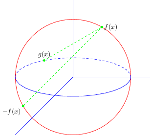
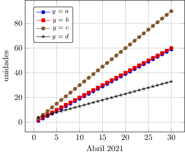

# Galería de ejemplos con TikZ/PGF

Para generar cada uno de los gráficos propuestos se ha usado una plantilla con el siguiente contenido:

```tex
\documentclass[border=5pt]{standalone}
\usepackage{tikz}
\usetikzlibrary{external}
\tikzexternalize[prefix=tikz/]
\usepackage{pgfplots}
\pgfplotsset{compat=1.17}
\newcommand{\inputtikz}[1]{
  \tikzsetnextfilename{#1}
  \input{tikz/#1.pgf}
}
\begin{document}
  \inputtikz{nombreArchivo}
\end{document}
```
El cambio que debe hacer es reemplazar **nombreArchivo** por el que corresponde al código que necesita compilar (ejemplo: graficoLineas) y para compilar haga uso de la siguiente instrucción:

```
pdflatex -synctex=1 -interaction=nonstopmode --shell-escape main.tex
```
Configura tu editor favorito para que este proceso sea más simple.
****

## Contenido
1. [Geometría](#geometria)
2. [Estadística](#estadistica)

****
## 1. Geometría <a name = "geometria"></a>

* [arcosCirculos.pdf](https://github.com/richmon43/LaTeXamples/blob/master/examples/TikZ/external/tikz/arcosCirculos.pdf)



```tex
\begin{tikzpicture}
  \draw[blue] (0, 0) -- (4, 0);
  \draw[blue] (0, 0) -- (-3, -3);
  \draw[blue] (0, 0) -- (0, 4);
  \draw[red] (0, 0) circle (3cm);
  \draw[blue] (-3, 0) arc(-180:0:3cm and 1cm);
  \draw[blue, dashed] (3, 0) arc (0:180: 3cm and 1cm);
  \node[fill = green, green, circle, draw, inner sep = 1pt] (A) at (210:3) {};
  \node[fill = green, green, circle, draw, inner sep = 1pt] (B) at (60:3) {};
  \node[fill = green, green, circle, draw, inner sep = 1pt] (C) at (120:3cm and 1cm) {};
  \draw[color = green, dashed] (A) node[below left, black] {$-f(x)$} -- %
    (B) node[right, black] {$f(x)$} -- (C) node[above, black] {$g(x)$};
\end{tikzpicture}
```
****

## 2. Estadística <a name = "estadistica"></a>

* [graficoLineas.pdf](https://github.com/richmon43/LaTeXamples/blob/master/examples/TikZ/external/tikz/graficoLineas.pdf)



```tex
\pgfplotstableread[col sep=comma]{rutaAlArchivo/nombreArchivo.csv}\graficoLineas
\begin{tikzpicture}
  \begin{axis}[xlabel={Abril 2021}, ylabel={unidades}, grid=major, legend entries={$y=a$,$y=b$,$y=c$,$y=d$}, %
    legend style={font=\footnotesize, rounded corners=2pt, at={(0.3,0.95)}}]
    \addplot table [x=dia, y=a] {\graficoLineas};
    \addplot table [x=dia, y=b] {\graficoLineas};
    \addplot table [x=dia, y=c] {\graficoLineas};
    \addplot table [x=dia, y=d] {\graficoLineas};
  \end{axis}
\end{tikzpicture}
```
****